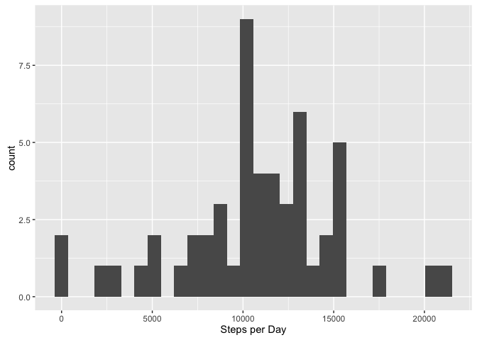
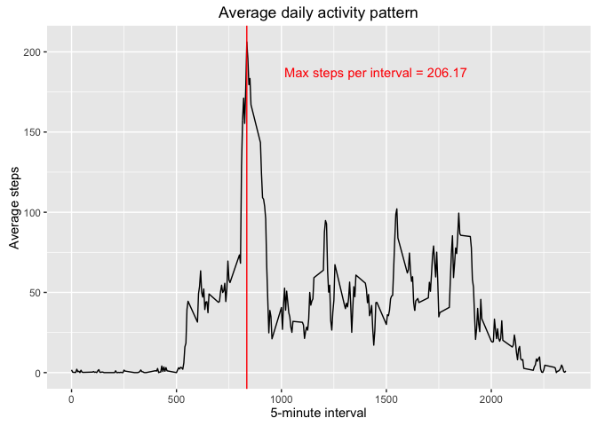
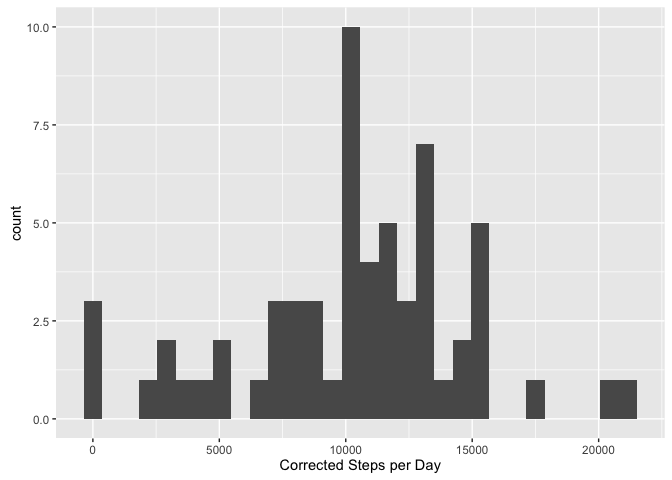
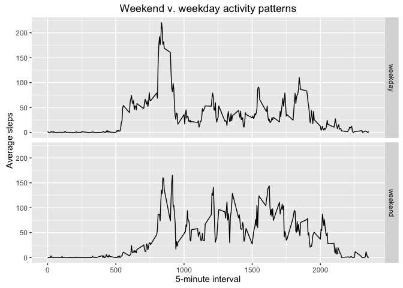

# Assignment 1: First Pass
@friendimaginary  
May 7, 2016  


## Introduction

This assignment makes use of data from a personal activity monitoring device. The data consists of two months of data from an anonymous individual collected during the months of October and November in 2012, and includes the number of steps taken in 5 minute intervals each day.


## Data

The data for this assignment may be downloaded from the [course web site](https://d396qusza40orc.cloudfront.net/repdata%2Fdata%2Factivity.zip).

The variables included in this dataset are:

* **steps**: Number of steps taking in a 5-minute interval (missing values are coded as `NA`)
* **date**: The date on which the measurement was taken in YYYY-MM-DD format
* **interval**: Identifier for the 5-minute interval in which measurement was taken

The dataset is stored in a comma-separated-value (CSV) file and there
are a total of 17,568 observations in this
dataset.


## Assignment

This assignment must be completed as a single R Markdown document that can be processed by knitr and transformed into valid HTML. This is that document. The default option for each code chunk is `echo = TRUE` so that these will always be visible. This makes peer review possible.

First, we must fork/clone the [GitHub repository created for this assignment](https://github.com/rdpeng/RepData_PeerAssessment1). This will be our working directory from this point forward. The GitHub repository also contains the dataset for the assignment, so it is not necessary to download the data separately. In a bash terminal:


```bash
git clone https://github.com/rdpeng/RepData_PeerAssessment1
```


### Loading and preprocessing the data

#### Part 1. Load the data (i.e., `read.csv()`):


```r
unzip( "activity.zip" )
activity <- read.csv( "activity.csv" )
head(activity)
```

```
##   steps       date interval
## 1    NA 2012-10-01        0
## 2    NA 2012-10-01        5
## 3    NA 2012-10-01       10
## 4    NA 2012-10-01       15
## 5    NA 2012-10-01       20
## 6    NA 2012-10-01       25
```


#### Part 2. Process/transform the data (if necessary) into a format suitable for your analysis


```r
stepsPerDay <- aggregate( steps ~ date , data = activity , FUN = sum , na.rm = TRUE )
stepsPerDay$steps <- as.numeric( stepsPerDay$steps )
```


### What is mean total number of steps taken per day?

For this part of the assignment, you can ignore the missing values in
the dataset.


#### Part 1. Make a histogram of the total number of steps taken each day


```r
if( "ggplot2" %in% installed.packages() == FALSE){ install.packages("ggplot2", dependencies = TRUE)}
require( ggplot2 )
```

```
## Loading required package: ggplot2
```

```r
qplot( stepsPerDay$steps , geom = "histogram" , bins = 30 , xlab = "Steps per Day" )
```

<!-- -->


#### Part 2. Calculate and report the **mean** and **median** total number of steps taken per day


```r
meanSteps <- mean( stepsPerDay$steps )
medianSteps <- median( stepsPerDay$steps )
paste( "The Mean is " , round(meanSteps,2) , " steps; and the median is " , medianSteps , 
       "." , sep = "" )
```

```
## [1] "The Mean is 10766.19 steps; and the median is 10765."
```


### What is the average daily activity pattern?


#### Part 1. Make a time series plot (i.e. `type = "l"`) of the 5-minute interval (x-axis) and the average number of steps taken, averaged across all days (y-axis)


```r
stepsPerInterval <- aggregate(steps ~ interval ,
                              data = activity ,
                              FUN = mean ,
                              na.rm = TRUE)
most <- stepsPerInterval[ which.max(stepsPerInterval$steps) , ]
tag <- paste("Max steps per interval = ", round(most$steps,2), sep="")
qplot(
    interval ,
    steps ,
    data = stepsPerInterval ,
    geom = "line" ,
    xlab = "5-minute interval" ,
    ylab = "Average steps" ,
    main = "Average daily activity pattern"
) + geom_vline( xintercept = 835 , color = "red" ) +
    annotate( "text" , x = 1450 , y = 187.5 , label = tag , col = "red" )
```

<!-- -->


#### Part 2. Which 5-minute interval, on average across all the days in the dataset, contains the maximum number of steps?


```r
print( paste( "The highest average number of steps is " , round(most$steps,2) , 
       ", occurring at interval " , eval(most$interval) , "." , sep = ""))
```

```
## [1] "The highest average number of steps is 206.17, occurring at interval 835."
```


### Imputing missing values

There are a number of days/intervals where there are missing values (coded as 
`NA`). The presence of missing days may introduce bias into some calculations or summaries of the data.


#### Part 1. Calculate and report the total number of missing values in the dataset (i.e. the total number of rows with `NA`s)


```r
missing <- sum( is.na( activity$steps ))
paste( "The total number of rows containing missing data is " , missing , "." ,
       sep = "" )
```

```
## [1] "The total number of rows containing missing data is 2304."
```


#### Part 2. Devise a strategy for filling in all of the missing values in the dataset. The strategy does not need to be sophisticated. 

To fill in missing values, one could use either the mean/median for that day, or 
the mean for that 5-minute interval. A slightly more complicated option, is to 
combine those two approaches. I will replace a missing value with the average 
value for its interval multiplied by the ratio of steps taken on that day to 
average daily steps. This approach should keep replacement values better aligned
to both the day and the interval.

Since this approach relies on the previously computed stepsPerDay, that must first be corrected to address missing values for entire days. Our approach in this case is replace the missing value with the average of the preceding and following days, dropping further NAs in this calculation.


#### Part 3. Create a new dataset that is equal to the original dataset but with the missing data filled in.


```r
all.days <- data.frame( "date" = unique( activity$date ))
all.days.steps <- merge( all.days , stepsPerDay , all = TRUE)
just.steps <- all.days.steps$steps

for( i in 1:length(just.steps) ) {
    if( is.na( just.steps[i]) == T ) { 
        just.steps[i] <- mean( c( just.steps[i-1] , just.steps[i+1]) , 
                               na.rm = T )}
}
stepsPerDay.corrected <- cbind( all.days , just.steps )
avgStepsPerDay.corrected <- mean( just.steps )
activity.corrected <- activity

for( i in 1:nrow(activity.corrected) ) {
    day <- activity.corrected[ i , 'date' ]
    steps <- stepsPerDay.corrected[ stepsPerDay.corrected$date == day , "just.steps" ]
    ratio <- steps / avgStepsPerDay.corrected
    interval.steps <- stepsPerInterval[ stepsPerInterval$interval == 
                                        activity.corrected$interval[i], 'steps']
    if( is.na(activity.corrected[ i , 'steps']) == TRUE ) {
        activity.corrected[i,'steps'] <- ratio * interval.steps
    }
}

head(activity.corrected)
```

```
##          steps       date interval
## 1 0.0210129771 2012-10-01        0
## 2 0.0041564131 2012-10-01        5
## 3 0.0016163829 2012-10-01       10
## 4 0.0018472947 2012-10-01       15
## 5 0.0009236473 2012-10-01       20
## 6 0.0256312138 2012-10-01       25
```


#### Part 4. Make a histogram of the total number of steps taken each day and Calculate and report the **mean** and **median** total number of steps taken per day. Do these values differ from the estimates from the first part of the assignment? What is the impact of imputing missing data on the estimates of the total daily number of steps?


```r
qplot( stepsPerDay.corrected$just.steps , geom = "histogram" , bins = 30 , xlab = "Corrected Steps per Day" )
```

<!-- -->

```r
meanCorrectedSteps <- mean( stepsPerDay.corrected$just.steps )
medianCorrectedSteps <- median( stepsPerDay.corrected$just.steps )
paste( "The Mean is " , meanCorrectedSteps , " steps; and the median is " , medianCorrectedSteps , "." , sep = "" )
```

```
## [1] "The Mean is 10295.5245901639 steps; and the median is 10571."
```

```r
comparison <- cbind( "mean" = c( meanCorrectedSteps , meanSteps ) ,"median" = 
                         c( medianCorrectedSteps , medianSteps))
row.names(comparison) <- c( "corrected" , "uncorrected")
comparison
```

```
##                 mean median
## corrected   10295.52  10571
## uncorrected 10766.19  10765
```


Replacing missing values with a simple average can artificially inflate measurements. By comparing activity levels in surrounding days to daily averages, and then applying that scale to interval averages, I believe I more accurately represent the missing data. A missing day between two low-activity days is likely to be another low activity day, and my method avoids introducing an unlikely spike in the newly imputed data.


### Are there differences in activity patterns between weekdays and weekends?

For this part the `weekdays()` function may be of some help here. Use
the dataset with the filled-in missing values for this part.


#### Part 1. Create a new factor variable in the dataset with two levels -- "weekday" and "weekend" indicating whether a given date is a weekday or weekend day.


```r
weekend.days <- c("Saturday","Sunday")
weekday.days <- c("Monday","Tuesday","Wednesday","Thursday","Friday")
for( i in 1:nrow(activity.corrected) ) {
    day.of.week <- weekdays( as.Date( activity.corrected[i,'date']))
    if( day.of.week %in% weekday.days == TRUE ) {
        activity.corrected[i, 'weekend'] <- 'weekday'
    }
    if( day.of.week %in% weekend.days == TRUE ) {
        activity.corrected[i, 'weekend'] <- 'weekend'
    }
    
}
activity.corrected$weekend <- as.factor(activity.corrected$weekend)
```


#### Part 2. Make a panel plot containing a time series plot (i.e., `type = "l"`) of the 5-minute interval (x-axis) and the average number of steps taken, averaged across all weekday days or weekend days (y-axis). 


```r
stepsPerInterval.corrected <- aggregate(steps ~ interval + weekend ,
                              data = activity.corrected ,
                              FUN = mean ,
                              na.rm = TRUE)

qplot(
    interval ,
    steps ,
    data = stepsPerInterval.corrected ,
    geom = "line" ,
    xlab = "5-minute interval" ,
    ylab = "Average steps" ,
    main = "Weekend v. weekday activity patterns"
) + facet_grid( weekend ~ .)
```

<!-- -->


```
https://github.com/friendimaginary/RepData_PeerAssessment1
```


```r
sessionInfo()
```

```
## R version 3.3.0 (2016-05-03)
## Platform: x86_64-apple-darwin15.4.0 (64-bit)
## Running under: OS X 10.11.5 (El Capitan)
## 
## locale:
## [1] en_US.UTF-8/en_US.UTF-8/en_US.UTF-8/C/en_US.UTF-8/en_US.UTF-8
## 
## attached base packages:
## [1] stats     graphics  grDevices utils     datasets  methods   base     
## 
## other attached packages:
## [1] ggplot2_2.1.0
## 
## loaded via a namespace (and not attached):
##  [1] Rcpp_0.12.5      digest_0.6.9     plyr_1.8.3       grid_3.3.0      
##  [5] gtable_0.2.0     formatR_1.4      magrittr_1.5     evaluate_0.9    
##  [9] scales_0.4.0     stringi_1.0-1    reshape2_1.4.1   rmarkdown_0.9.6 
## [13] labeling_0.3     tools_3.3.0      stringr_1.0.0    munsell_0.4.3   
## [17] yaml_2.1.13      colorspace_1.2-6 htmltools_0.3.5  knitr_1.13
```
